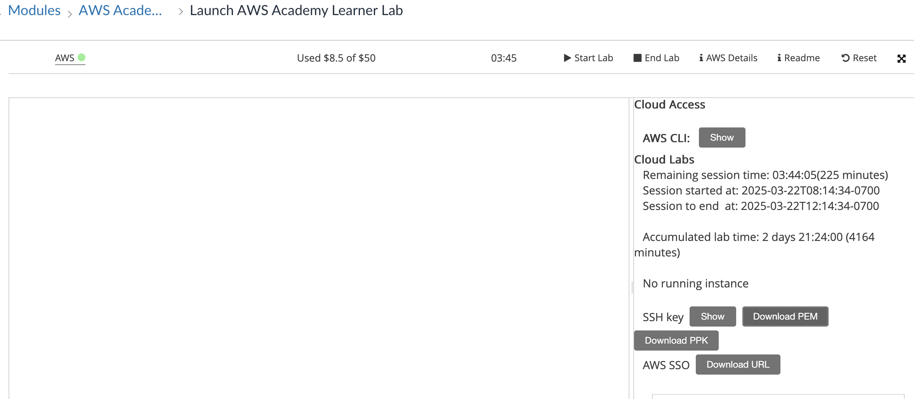

# Multi-OS EC2 Configuration with Ansible (Assignment 10)

This repository demonstrates the use of [Ansible](https://github.com/ansible/ansible).

The assignment description is below:

- Update your previous Terraform assignment to provision 6 EC2: 3 Ubuntu and 3 Amazon Linux. Tag them with (OS: ubuntu or OS:amazon). 1 more EC2 instance to host the Ansible Controller

- Create an Ansible Playbook for the 6 EC2 instance

- Target the 6 ec2 instances and perform the following:
    - Update and upgrade the packages (if needed)
    - Verify we are running the latest docker
    - Report the disk usage for each ec2 instance

Update your repo with a new branch and update the README file for me to follow the instructions so I can run the terraform provisioning and the ansible playbook.

**Note:** Example and usage steps below are written for the AWS Academy Learner Lab and MacOS environment. There may be slight changes needed to run in other environments.

## Prerequisites

Clone this repository by branch with the following command:

`git clone --single-branch --branch assignment10 git@github.com:lawrenceslng/Packer-Terraform_Example.git`

and `cd` into the root directory. Before starting, you should make sure you have the following installed:

- Terraform

    Download Terraform using the link and instructions here: https://developer.hashicorp.com/terraform/install?product_intent=terraform

    For MacOS users using homebrew, you can simply run the following commands:
    ```
    brew tap hashicorp/tap          
    brew install hashicorp/tap/terraform
    ```

    Run `terraform -help` in the terminal to verify installation is successful    

    

- AWS CLI

    Download AWS CLI using the link and instructions here:
    https://docs.aws.amazon.com/cli/latest/userguide/getting-started-install.html

    Run the following commands to input your credentials from Learner's Lab:
    ```
    aws configure
    aws configure set aws_session_token <YOUR_SESSION_TOKEN_HERE>
    ```

    

- Download the SSH Key from Learner Lab

    You should download the PEM file containing the default SSH Key (vockey) from Learner's Lab into the root directory of this repository for use later. Make sure to run `chmod 600 <PEM_FILE>` to make it have the correct permissions for ssh use later.

    

## Manual Usage

You can run the examples in this repository manually. 

### Step 1

Before running the Terraform files, you need to go into `variables.tf` and double check/replace the following variables:

- ansible_ingress_ip_address

    Put your public facing IP address in line 3 with `/32` appended. You can find your IP address using `curl -4 ifconfig.me` in your terminal or using https://whatismyipaddress.com/. Example: `8.8.8.8/32`

### Step 2

Now you can run the commands:

```
terraform init
terraform fmt
terraform validate
terraform apply
```

Enter `yes` during the apply step to confirm that the infrastructure should be created.

These steps will first initialize the terraform directory and downloads the `aws` provider. Then it will format and valide your configuration to ensure they are valid. Finally it will create the infrastructure defined in the configuration in your AWS environment. 


### Step 3

You should now see the infrastructure created if you log into the AWS console.

Find the public IP address of the EC2 machine named `ansible-controller`. Run the following command in the root directory of this repository:

`scp ansible_playbook.yaml aws_ec2.yaml ec2-user@<ANSIBLE_CONTROLLER_IP>:~`

This will copy over the Ansible playbook and dynamic inventory file over to the machine.

### Step 4

You can now ssh into the Ansible Controller using the following command:

```
chmod 600 <PEM_FILE>
ssh-add <PEM_FILE>
ssh -A -i <PEM_FILE> ec2-user@<ANSIBLE_CONTROLLER_IP>
```

Configure AWS Credentials by running: 

```
aws configure
aws configure set aws_session_token <SESSION_TOKEN_HERE>
```

### Step 5

You are now ready to run the playbook. Run the following command in the Ansible Controller EC2 machine:

```
ansible-playbook -i aws_ec2.yaml ansible_playbook.yaml
```

Type `yes` when it asks for you to confirm you want to connect to the various private EC2 instances. 

### Step 6

You can login to each of the private EC2 instances and verify that docker is installed by running the command:

```
sudo docker ps
```

### Step 7 (Clean Up)

Once you are done, delete all created infrastructure by running `terraform destroy` in the terminal. Again, enter `yes` to confirm.

## Conclusion

We have successfully used Ansible to configure machines to install and run the latest version of Docker and report back their disk usages!